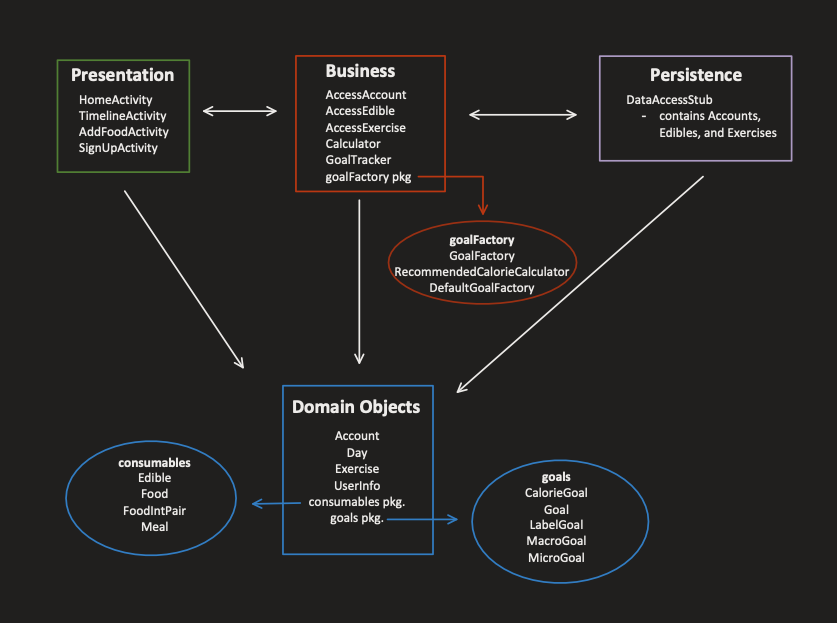

# Iteration 1 - Meal Buddy

Group 5:

- Arvind Maan
- Amin Lawal
- Caden Chabot
- Emmanuel Valete
- Mark Shinnie

The contents of the electronic submission are as follows:

```python

|___ app – src – main
    |_____java
        |__ application
        |__ business
           |___ goaltracker
        |__ objects
            |__ consumables
            |__ goals
        |__ persistence
        |__ presentation
    |_____res
        |___ layout
        |    |___ activity files xml...
        |___ values
        |    |___ spinner arrays..

```


Overall view of the features implemented (seen in UI):
  
- Homepage UI – landing page for the application.
- Sign up UI – the sign up page to create an account. (click sign up from the home activity)
- Timeline UI – visual representation of the food eaten in day divided into breakfast, lunch, dinner and snack. (enter a valid login or create a new account to get to this activity).
- Add food to timeline – click on the add food button in the timeline to be redirected to a page that adds food.

Features that were implemented that can't be seen through UI:
  
- Goals, Calculator (briefly seen in timeline but a more descriptive page will be made in iteration 2), GoalTracker, default/recommended goals, and more!




Log is kept in google docs:
[link to google docs](https://docs.google.com/document/d/1vSGLt0tYSggLiW37SI4Xh2EagJ64Fbn786I-1gTtyyk/edit?usp=sharing)

Also a .txt file under the name of log_iteration1.txt.

Link to the private github repository:
[link to repo](https://github.com/COMP3350-Group5/meal-buddy)

Application was tested on Nexus 7 emulator Marshmellow API level (23)<br>
[emulator: Nexus 7 Api 23 | Android 6.0]<br>
_Note: the application has some code that relies on Java8, this is a dependenacy in the project._
