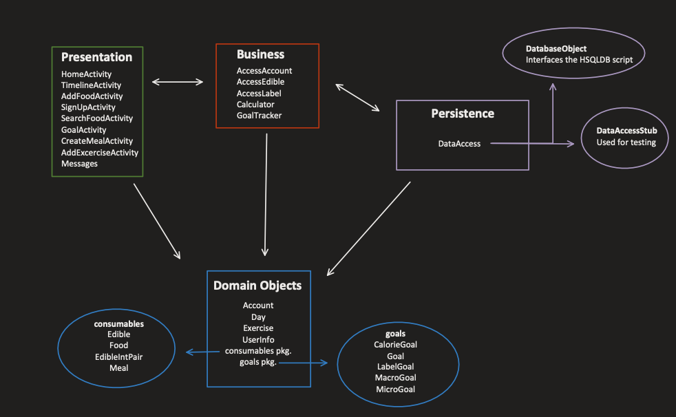

# Iteration 2 - Meal Buddy

Group 5:

- Arvind Maan
- Amin Lawal
- Caden Chabot
- Emmanuel Valete
- Mark Shinnie

The contents of the electronic submission are as follows:

```python

|___ app – src – main
    |_____java
        |__ application
        |__ business
        |__ objects
            |__ consumables
            |__ goals
        |__ persistence
        |__ presentation
    |_____res
        |___ layout
        |    |___ activity files xml...
        |___ values
        |    |___ spinner arrays..

```


### Overall view of the features implemented (seen in UI):

- SearchFoodActivity
created an activity that searches the food database and allows a user to add from the database.
- AddFoodActivity
updated the food activity to add to the database and can only be reached from the searchFoodActivity
- CreateMealActivity
allows the user to create a meal (meal is comprised of other edibles)
- We added exercise to the timeline and have an activity as well as changes to the timeline activity.
- Added an account view that allows the user to change their personal information
- Added a goal view that allows for the deletion and addition of goals. As well as allows you to view your current goal status.

### Features that were implemented that can't be seen through UI:

- The database was implemented this iteration which allows us for persistent storage.
- Exercise logic was introduced in the calculator to account for calories that can be burned.


## Iteration 2 architecture:



## Additional information

Log is kept in google docs:
[link to google docs](https://docs.google.com/document/d/1vSGLt0tYSggLiW37SI4Xh2EagJ64Fbn786I-1gTtyyk/edit?usp=sharing)

Also a .txt file under the name of log_iteration2.txt.

Link to the private github repository:
[link to repo](https://github.com/COMP3350-Group5/meal-buddy)

Application was tested on Nexus 7 emulator Marshmellow API level (23)<br>
[emulator: Nexus 7 Api 23 | Android 6.0]<br>
_Note: the application has some code that relies on Java8, this is a dependenacy in the project._
