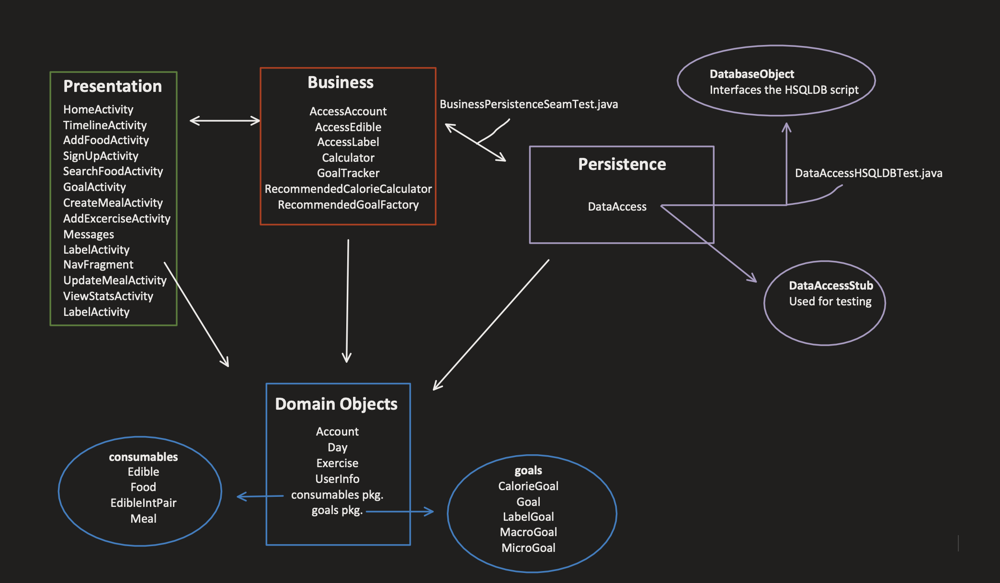

# Iteration 2 - Meal Buddy

Group 5:

- Arvind Maan
- Amin Lawal
- Caden Chabot
- Emmanuel Valete
- Mark Shinnie

The contents of the electronic submission are as follows:

```python

|___ app – src – main
    |_____java
        |__ application
        |__ business
        |__ objects
            |__ consumables
            |__ goals
        |__ persistence
        |__ presentation
    |_____res
        |___ layout
        |    |___ activity files xml...
        |___ values
        |    |___ spinner arrays..
|____ docs
     |__ iteration files...
|
|
... misc files ...

```


### Overall view of the features implemented (seen in UI):

- ViewStatsActivity
View the total and average statistics for a user
- TimelineActivity was updated 
Can now view each meal time and see the food that make it up in a much nicer way.
Can also interact with exercise.
- LabelActivity
Can view the labels in the database and update/add/remove them.
- UpdateMealActivity
Allow you to update the food in a meal.
- NavFragment
A fragment containing the code for our bottom navigation bar.
- Added the default goals and default day functionality

### Features that were implemented that can't be seen through UI:

- Added the integeration tests.
- Added the acceptance tests.
- Refactored the days object to return iterators as opposed to the entire list of goals and exercises.
- Overall bug fixing and code cleaning

## Iteration 3 architecture:



## Additional information

Log is kept in the iteration 3 deliverable, also in a .txt file under the name of log_iteration3.txt.

Link to the private github repository:
[link to repo](https://github.com/COMP3350-Group5/meal-buddy)

Application was tested on Nexus 7 emulator Marshmellow API level (23)<br>
[emulator: Nexus 7 Api 23 | Android 6.0]<br>
_Note: the application has some code that relies on Java8, this is a dependenacy in the project._
